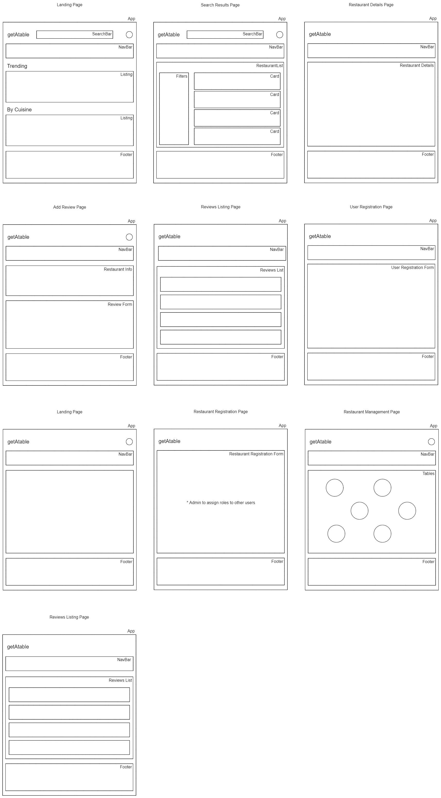

# getAtable

getAtable was created with the goal of saving time by assisting consumers in making decisions when looking for restaurants that can accommodate their party size for an unplanned group lunch or dinner.

This full-stack application also serves to fulfill the academic requirements of General Assembly's Software Engineering Immersive capstone project.

# Table of Contents

1. [Description](#description)
2. [Technologies Used](#technologies-used)
3. [Dependencies to install](#dependencies-to-install)
4. [Users Stories](#users-stories)
5. [Wireframes](#wireframes)
6. [Back-end Repo](#link-to-getatable-backend-repo)
7. [API endpoints](#api-endpoints)
8. [Tables](#tables)

# Description

We are all familiar with the feeling of disappointment upon arriving at a walk-in only restaurant/café/bar only to learn that the venue is filled and a long line of people waiting to be seated. The options available would be either join the wait or to stroll around seeking for alternative places and settle on one before it is too late for the last order.

Times like this ruins the fun of any gathering.

Since calling a restaurant during peak hours is a pain, wouldn't it be great to have an app that can verify a restaurant's current seating capacity without having to call the restaurant and search for other similar locations nearby with your phone that can accommodate your party size and dietary requirements if your first choice is unavailable prior to your arrival?

This is what getAtable aims to accomplish.

# Technologies Used

### Front-end

1. React.js
2. HTML
3. CSS: Tailwindcss and Tailwind Elements

### Back-end

1. Express.js
2. node-postgres

### Database

1. Postgresql

# Dependencies to install

|     | In React.js       |
| --- | ----------------- |
| 1   | React-Hook-Form   |
| 2   | React-Router-Dom  |
| 3   | Tailwindcss       |
| 4   | Tailwind Elements |

 

        npm i react-hook-form react-router-dom tailwindcss tw-elements

 

|     | In Express.js |
| --- | ------------- |
| 1   | Node-Postgres |
| 2   | BCrypt        |
| 3   | CORS          |
| 4   | Dotenv        |

 

        npm i pg bcrypt cors dotenv

 

# Users Stories

## Consumers

When a restaurant does not accept reservations, as a consumer, I would like to be able to:

1. Check the status of a restaurant easily, preferably without calling, when deciding where to eat during a group outing
2. Look for alternatives if my first choice is full or waiting time is too long

 

Why should I use the app?

- an app that allows me to save time, effort and avoid disappointment when dining out in groups
- good for impromptu lunch/dinner plans
- avoid crowded places
- don't have to walk around physically in search of alternatives

 

When I am looking for alternatives, I would like the ability to:

- check the restaurant ratings
- check comments left by other diners
- check distance between my current location and that of the alternative restaurant(s)
- check distance between the location of my first choice and the alternatives
- share information about the alternative restaurant(s) with the rest of the group to decide the next steps

 

What information I can check using the app:

- if the restaurant is currently at full capacity
- if there is enough capacity to take in X number of diners
- if there is a long waiting time (queue situation)

## Restaurants

Why should the restaurant/cafe/bars use the app?

- manage walk-ins and queues, especially during peak hours
- minimize crowds gathering outside the restaurant
- launch ads during off-peak hours (using geolocation, geofencing and push notification)
- keep track of time per table
- inform consumers on opening/closing time and last order status
- monitor customers' feedback
- more advance usage with implementation in their POS system
  - contactless payment
  - a digital menu for ordering
  - kitchen management

# Types of login

|     | Login              | Routes             |
| --- | ------------------ | ------------------ |
| 1   | Consumers          | /users/login       |
| 2   | Restaurant Manager | /restaurants/login |
| 3   | Restaurant Staff   | /restaurants/login |

# Wireframes

<!-- # List of Features -->

# Regarding Back-end

### [Link](https://github.com/girafffz/getAtable-Backend) to getAtable backend repo

## API Endpoints

### 1. Users Endpoints

| CRUD Operation | Description             | API endpoints   |
| -------------- | ----------------------- | --------------- |
| Create         | Create new user account | /users/register |
| -              | Login                   | /users/login    |
| Read           | View a user's details   | /users/:user_id |
| Read           | Update a user's details | /users/:user_id |
| Read           | View all users          | /users          |

### 2. Restaurant Endpoints

| CRUD Operation | Description                   | API endpoints    |
| -------------- | ----------------------------- | ---------------- |
| Create         | Create new restaurant account | /restaurants/:id |
| Read           | View a restaurant's details   | /restaurants/:id |
| Update         | Update a restaurant's details | /restaurants/    |
| Read           | View all restaurants          | /restaurants/    |

### 3. Restaurant Staff Endpoints

| CRUD Operation | Description                    | API endpoints                 |
| -------------- | ------------------------------ | ----------------------------- |
| Create         | Create new staff account       | /restaurants/:id/staff/create |
| -              | Login                          | /restaurants/staff/login      |
| Read           | View a staff's details         | /restaurants/:id/staff        |
| Update         | Update a staff's details       | /restaurants/:id/staff/update |
| Delete         | Delete a staff's account       | /restaurants/:id/staff/delete |
| Read           | View all staff of a restaurant | /restaurants/:id/staff        |

### 4. Restaurant Seats Capacity Endpoints

| CRUD Operation | Description                    | API endpoints             |
| -------------- | ------------------------------ | ------------------------- |
| Create         | Create a restaurant's capacity | /restaurants/:id/capacity |
| Read           | View a restaurant's capacity   | /restaurants/:id/capacity |
| Update         | Update a restaurant's capacity | /restaurants/:id/capacity |

## Tables

|     |                            |
| --- | -------------------------- |
| 1   | restaurants                |
| 2   | restaurant_operating_hours |
| 3   | locations                  |
| 4   | restaurant_locations       |
| 5   | cuisines                   |
| 6   | restaurant_cuisines        |
| 7   | tags                       |
| 8   | restaurant_tags            |
| 9   | restaurant_staff           |
| 10  | restaurant_media           |
| 11  | restaurant_seats_capacity  |
| 12  | users                      |
| 13  | reviews                    |
